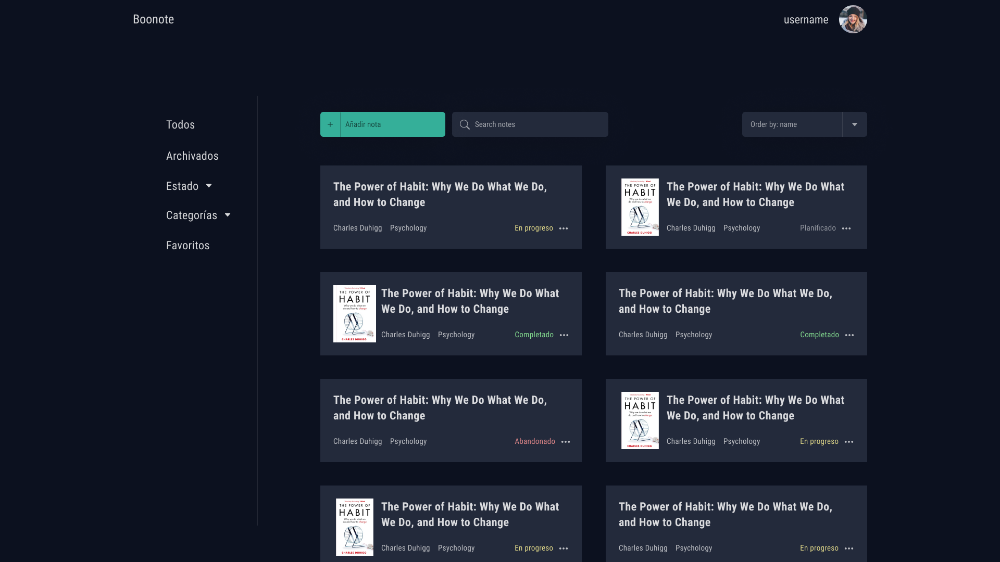

# Boonote Front End

It has been six months since I updated this project. I said that I have plans to update this small project into a full stack web application. Now I am finally working again on this project. At the moment the back end is in my Github profile with a basic REST API using PHP and Laravel.

In the next weeks I am going to update the front end and the back end. I am currently designing a new interface and I have plans to upload the code into a server and a custom domain so that anyone can use it, though I doubt that more than 10 persons will use it.

Here it is a snapshot of what the design will look like.

If you want to keep track of the design I am making here it is a [link](https://www.figma.com/file/2AErzOKmGVQH6kTOJq5aGg/Boonote) to the figma file

## Old Project Description

This web app consists of creating book notes for every book we read

To be a able to run this project you need to run the following command `npm install` to install dependencies

To start this project in development mode you need to run the command `npm start`

The project uses Redux for book notes and author and categories tag to use it in other parts of the application such as book page and home page

For every state action change it saves the state into localStorage. I plan to create a backend using Laravel to store and retrieve state from databases. I have the goal of expanding this project to create a large project to show my skills and keep learning higher architecture concepts. In the following weeks I will be adding new features.

In this web app I used React composition concept in the select components wrapping `<Select />` into `<SearchSelect />` to use a different type of select that allows us to search for options. This select also gives us the possibility of creating new options that can be saved in Redux global state.